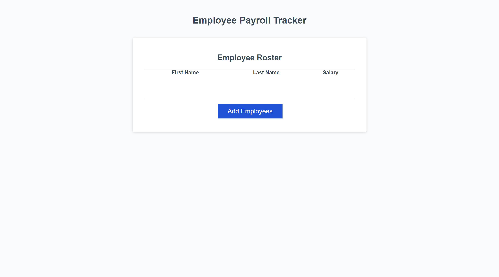
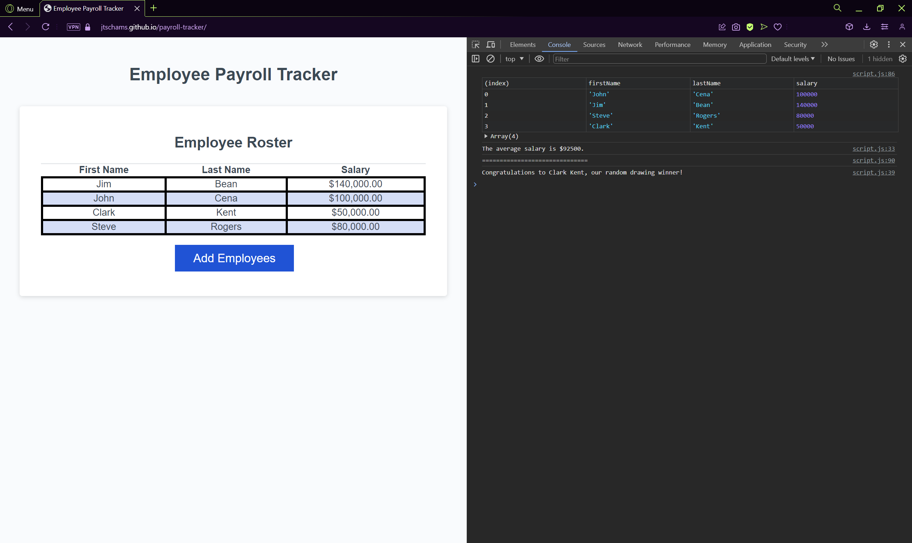

# Payroll Tracker

## Description

This repository was made for the purpose of adding javascript functions to an existing page.  The added functions enable collection of employee names and salaries, output of the average salary, and selection of a random employee to win a drawing.  The code is designed to only accept a number for the salary, as well as to not add incomplete data.

## Visuals

## Usage

On clicking Add Employees button, user will be prompted to add employee first name, last name, and salary.  A salary that is not entered as a number will be re-prompted to enter, and an employee missing a first or last name will not be saved.  Once complete, user will be asked if they would like to add and additional employee.  Once user finishes adding employees, they will be displayed in a table.  The developer console can be opened to view their average salary and a drawing winner randomly selected from the entered employees.

## Technologies Used

HTML 5, CSS 3, Javascript ES6+

## Links

[Page Link](https://jtschams.github.io/payroll-tracker/)

[Repository link (Github)](https://github.com/jtschams/payroll-tracker)

[Author Github Profile](https://github.com/jtschams)

## Credits

N/A
